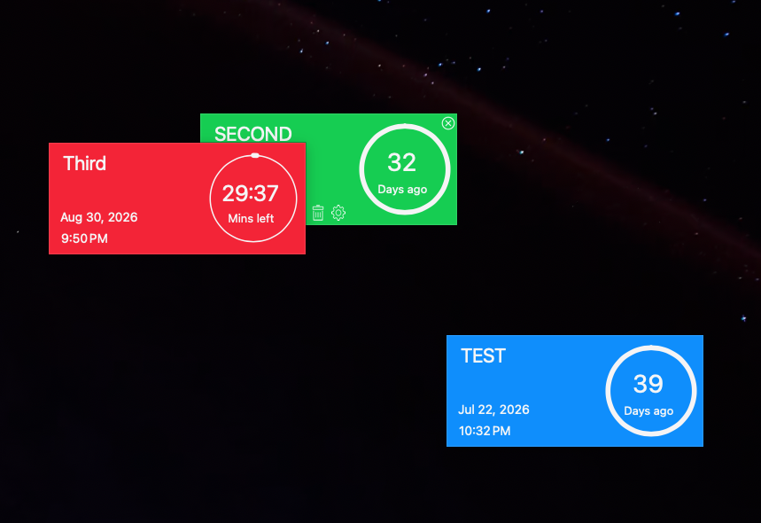
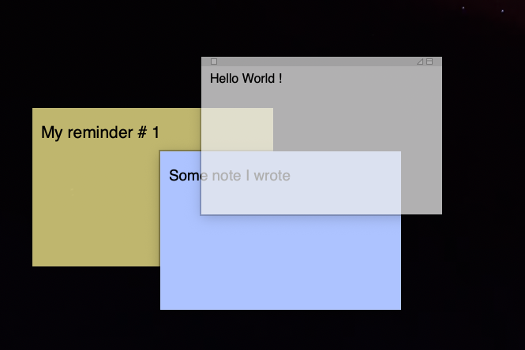
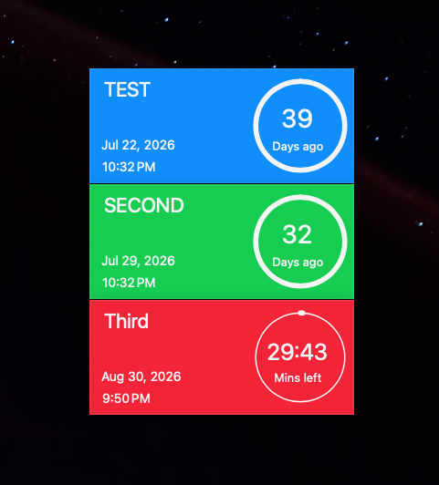
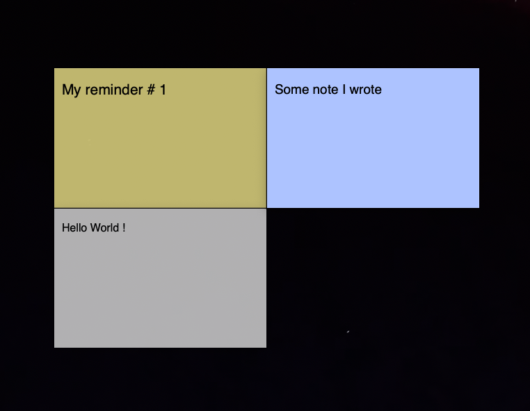

# Save Plists

Save the window layouts of plist-based apps such as Stickies, Dock, and Countdown Timer Plus. Restore them later if a restart, an OS install or update, or a crash scrambles them.

[Save Plists repo](https://github.com/joveuh/save-plists)

## How to use it

Clone the repo. While your windows are arranged the way you like, run:

```
python saveall.py
```

This saves the Stickies, Dock, and Countdown Timer Plus settings. You can also save individual settings with case-insensitive args:

```
python saveall.py stickies DOCK
```

This saves only the Stickies and Dock settings.

When your layout gets lost, restore everything:

```
python restoreall.py
```

Or restore individual settings:

```
python restoreall.py CounTDowN
```

## Why this exists

After a restart or an OS install or update, the windows lose their arrangement and pile up in a mess. This repo saves the original formation, so one command puts every window back where it was.

The screenshots show Stickies and Countdown Timer Plus. The scripts cover more apps than the screenshots show — the Dock is also saved.

### After a restart — the layout is scrambled





### After `restoreall.py` — the original formation is back




